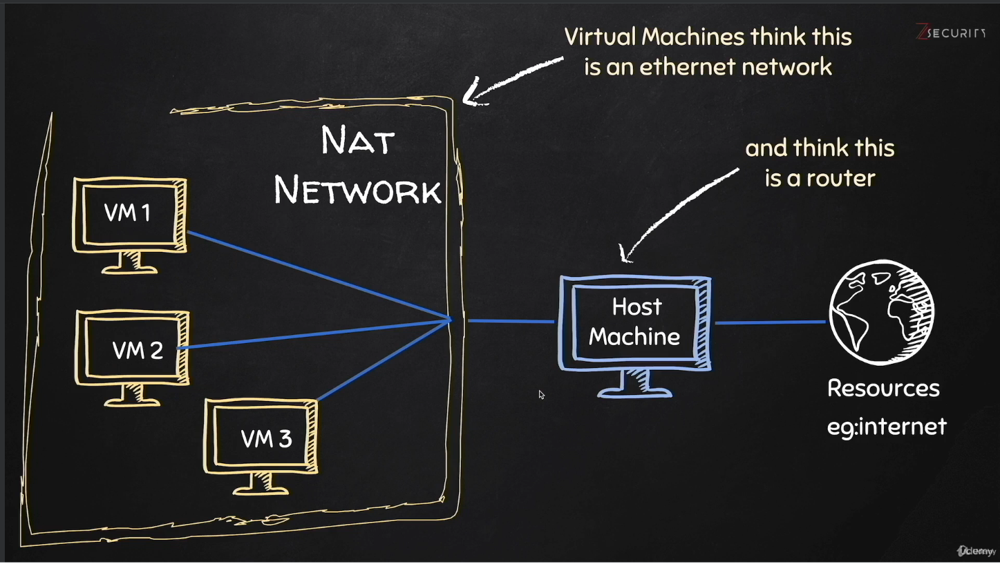

## 01 Introduction

### Course Introduction

* Topic of this course is _Ethical Hacking with Python_
    * Kali Linux Setup
    * Network Basics & Layers
    * Sending and Receiving Data
    * Websites & Servers
    * Malware & Backdoors
* Lectures are hands-on with programming
    * Algorithm Design & Implementation
    * Python Scripting

Sections:

1. Setup:
    * Install VirtualBox
    * Download and Run Kali Linux
    * Getting IDE/Editor for Python

### Introduction to Ethical Hacking & Python
Definitions: 
* __hacking__: gaining unauthorized access to a system or software (unauthorized ≠ illegal)
* types of hackers:
    * __black hat__: hacking illegally with criminal goals
    * __white hat__: hacking (with permission) to test and report vulnerabilities
* __pen-testing__: or penetration testing is synonymous with ethical hacking
* __scripting__: (automatic) execution of self-written software code (for any purpose)
* __programming__: writing a set of instructions (code) to solve a task or problem

Why learn hacking?
* is essential part of the cyber security, national security, and robust software development industry
* ethical hacking is in high demand with bug-bounty programs or full-time jobs

### Setting up your hacking Lab - Overview
Why have a lab?
* for starters, it's place to experiment and practice hacking, without breaking or modifying your host machine
* the go-to operating systems for anything programming is always Linux-based
* for pen-testing, __Kali Linux__ is the OS to use as it's designed for that purpose

Virtualization 
* this helps to create several __virtual machine__ for the purpose of your lab and a target systems to hack into 
* benefits are using several OS in parallel and note breaking your main machine
* virtualization sofwares: Oracle VMBox, VMWare

Mobile Lab
* for advanved hackers, one can set up a _mobile lab_ by putting the Kali OS on a thumb drive or SD card (or even on your phone)

### Preparation
Kali Linux
* Linux distribution based on debian and made for pen-testing
* comes pre-installed with a plethora of pen-testing software tools
* can be installed on virtual machine or thumb drive
* the course provides a [custom-version of Kali](https://zsecurity.org/download-custom-kali/) streamlined for this learning experience

Enabling Virtualization on Windows
* check, if virtualization is enabled
    * press `Win` + `R`
    * type `taskmgr` and press `Enter`
    * go to the Performance tab, click CPU
    * look for the _virtualization: dis-/enabled_ 
* enabling virtualization
    * reboot the computer and enter the BIOS → key combination differs by computer
    * navigate the menu and look for virtualization → enable and continue boot-up

### Installation of Kali as VM (for Windows)
Instructions
* de-dompress the downloaded Kali-vm file with 7z
* download and install VMWare for Windows from [vmware.com](https://www.vmware.com/products/workstation-player.html)
* run VMware and select the Kali virtual image
* adjust the settings before starting the virtual machine
    * memory: between 2 and 4 GB
    * processors: 2
    * network adaptpr: NAT
    * display: enable 3D graphics (optional)
* start running the virtual machine (to escape to host machine, press `CTRL` + `ALT`)

Excursion: NAT
<p align="left">
  
</p>

* through the NAT-network various virtual machines can interact with one another
* this is perfect to learn and practice hacking in safe environment 

### Kali Linux Basics 🐲
* Kali Linux is an OS designed and intended for pen-testing
* therefore, it comes pre-installed with many tools for:
    * information gathering
    * vulnerability scanning
    * reverse engineering
    * password attacking
    * ...
* the file manager and system setting are similar to other Linux distributions
    * play around to get familiar
* in the settings, change the keyboard layout to match your own keyboard

### Linux Terminal Commands 🖳
Why use terminals?
* modern software like servers or databases provide a command line inteface (CLI)
* the CLI is more powerful and their graphical user interface (GUI)
* it is they way many software tools are administered by an organization's IT-admin
* many IoT-devices (like RasperryPi) can only be interfaced by terminal

Basic Commands
* `pwd`: present working directory
* `ls`: list file and sub-directories in current directory
    * `ls -a`: list all files including hidden ones
    * `ls -l`: list files with permissions
* `cd Desktop`: change directory to Desktop (directories are case-sensitive)
    * `cd ..` go back/up one level
* `man ls`: shows a user manual for the `ls`-command (exit with `q`)
* `--help`: will provide a help message for the command

Flags & Parameters
* a flag activates special function of command
    * the long version has 2 dashes and is written out: `--help`
    * the short version has 1 dash and is single letter `-h`
* sometimes these flags use input parameters, like specifying a filepath

Install/Remove Applications
* `apt-get update`: updates the local catalogue of available software
* `apt-get install my_software`: downloads and install "my_software" 
* `apt-get remove my_software`: removes my_software from the machine

Resources
* [overview](https://www.mediacollege.com/linux/command/linux-command.html) of the most common Linux commands
* if you ever come across a command (online) that you don't understand, use [explainshell.com](https://explainshell.com/)

### Python 🐍
Python: 2 vs 3
* Kali Linux comes pre-installed with Python2 and Python3
    * Python runs with an interpreter rather than a compiler
* while most programming courses only teach Python3, legacy software made from Python2 is still plenty
* to better understand Python2-based software, read legacy code, and finds it vulnerability, we will learn both major versions
* there special libraries that make Python code either backwards or forwards compatible


Where to write code?
* a simple text-editors, such as leafpad or notepad++, that are sufficient in writing simple scripts in Python
    * they already provide syntax support
* but to execute code, run tests, manage environments, add databases, or other advanced features, an __integrated development environment__ is beneficial (IDE)
* they are designed for a specific programming languages like PyCharm
* or generic ones extendable for many languages, like VSCode

Your 1st Python Scripts
* copy and paste the following code:
    ```python
    #!/usr/bin/env python3
    print("Hello World!")
    ```
    * 1st line: a linux shebang that makes the file executable
    * 2nd line: python code that prints a string to console
* run this in the terminal with the following command: `python3 hello_world.py`

Installing an IDE
* IDEs can help with refactoring, testing, and managing resources
* this course recommends PyCharm 
* I use VSCode:
    * go to https://code.visualstudio.com/download
    * download `.deb` version matching your machine
    * in Downloads, run `sudo apt install ./code_amd64.deb`
    * in your project directory, run `code .`
* now, you're ready to code 👨‍💻