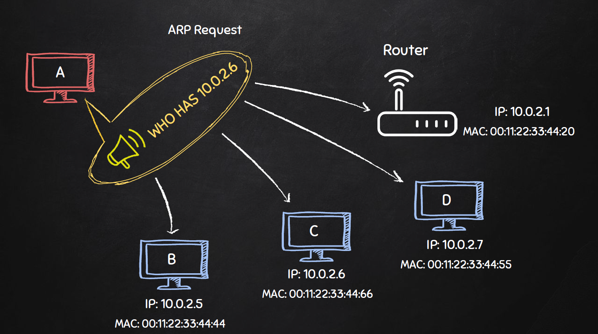
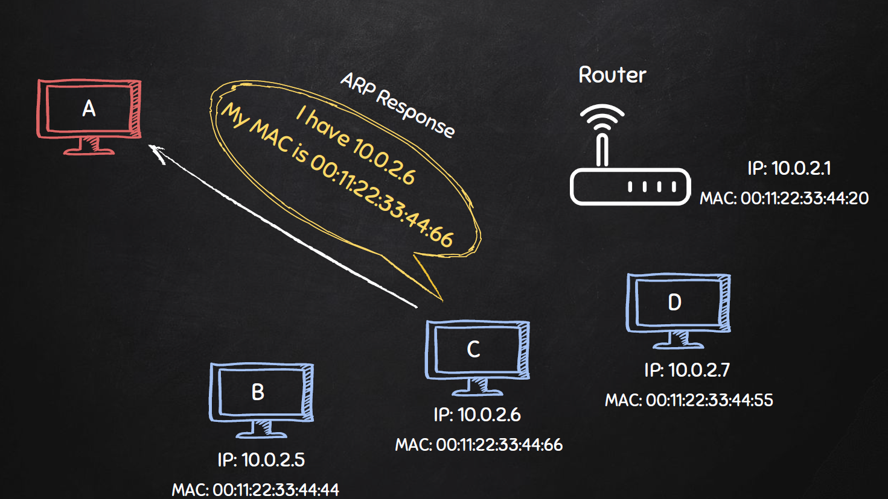

## 04 Network Scanner

### Introduction
What we will learn
* discover all devices on the network
* display their IP- and MAC-addresses 
* the scanner we build will be similar to Kali's `netdiscover`
    * it discovers all devices on your local network, like smart phones, computers, etc.
* network attacks in real-life may require a wireless adaptor
    * the course's recommended adaptor is "Realtek RTL8812AU 2.4 & 5 Ghz USB Wireless Adapter"
* in this course, we'll use a network simulated between the virtual machines inside your VMware

### Installing a Windows Virtual Machine
Why another virtual machine?
* to practice hacking, we need a target machine to try and gain access to
* since setting up physical machines costs a lot more time and money, we'll set up another virtual machine
* they are also easier to restore, if you break something

Why Windows?
* Windows is one of the most common operating systems not only for personal computers but also on vending terminals
* Microsoft has a selection of images for virtual machines

Installation Instruction
1. Download the 7z file from the course resources
2. Extract the Windows Image
3. Load the file in VMware
4. Adjust the memory to 1GB
5. Run and login with "Passw0rd!" 

### Introducing ARP
Simulating a local network
* the source machine may know the target's IP address but not it's MAC address
* the source machine requests information from the target machine through ARP
* ARP = __acccess resolution protocol__
* device _A_ will broadcast a request to all devices but only device _D_ reponds
* now that device _A_ knows the MAC address, it can start sending data to device _D_
* it's a simple and fast protocol

| ARP Request | ARP Response |
|:-:|:-:|
|||

Hacking the ARP with `scapy`
* once we discovered the all IP addresses on our local network (e.g. through `netdiscover`), we can use the standard ARP to request the MAC address of each device
* we will use the third-party Python module called `scapy`,
    * can probe, scan or attack networks
    * can replace hping, arpspoof, arp-sk, arping, p0f and even some parts of Nmap, tcpdump, and tshark
    * more in the [documentation](https://scapy.readthedocs.io/en/latest/introduction.html#about-scapy)
* checking and installing third-party module:
    * to check if a Python module is already installed: `pip list | grep scapy`
    * to install if the module did not show up: `pip install scapy`

### Network Scanner Algorithm
Goal: discovering clients on the same network
1. create ARP request to discover MAC addresses
2. send packet and receive respone
3. parse the reponse
4. analyse the results

### ARP Request Broadcast
Creating a Request
* you can use scapy's built-in list command to learn about the fields of a class
    ```
    scapy.ls(scapy.ARP())
    hwtype     : XShortField                         = 1               (1)
    ptype      : XShortEnumField                     = 2048            (2048)
    hwlen      : FieldLenField                       = None            (None)
    plen       : FieldLenField                       = None            (None)
    op         : ShortEnumField                      = 1               (1)
    hwsrc      : MultipleTypeField                   = '00:0c:29:52:5f:12' (None)
    psrc       : MultipleTypeField                   = '192.168.238.128' (None)
    hwdst      : MultipleTypeField                   = '00:00:00:00:00:00' (None)
    pdst       : MultipleTypeField                   = '0.0.0.0'       (None)
    ```
    * the `pdst` field is the IP address that we want to scan
* build a simple scanner
    ```python
    def scan(ip: str):
        # create a basic ARP request
        arp_request = scapy.ARP(pdst=ip)
    ```

### Combining Frames to Broadcast Packets
* next we'll look at the `scapy.Ether()` object
    ```
    scapy.Ether()
    dst        : DestMACField                        = 'ff:ff:ff:ff:ff:ff' (None)
    src        : SourceMACField                      = '00:0c:29:52:5f:12' (None)
    type       : XShortEnumField                     = 36864           (36864)
    ```
    * to broadcast to all clients, it uses the default `ff:ff:ff:ff:ff:ff`
* to create a final packet, you can simply combine the broadcast and the ARP request with a forward slash `/`
    ```python
    def scan(ip: str):
        arp_request = scapy.ARP(pdst=ip)
        broadcast = scapy.Ether(dst="ff:ff:ff:ff:ff:ff")
        arp_request_broadcast = arp_request / broadcast
    ```
* the methods `.summary()` and `.show()` will provide more information for the content of a given scapy object

### Sending and Receiving Packets
* the `scapy.srp()` function stands for send-and-receive-packets
    * a timeout prevents the program from running endlessly without response
    ```python
    def scan(ip: str):
        arp_request = scapy.ARP(pdst=ip)
        broadcast = scapy.Ether(dst="ff:ff:ff:ff:ff:ff")
        arp_request_broadcast = arp_request / broadcast
        answered, unanswered = scapy.srp(arp_request_broadcast, timeout=1)
    ```
* for more information, consult the [documentation](https://scapy.readthedocs.io/en/latest/usage.html#send-and-receive-packets-sr)

### Parsing the Response
* the response-objects is in the answered-list are arp_request_broadcast objects as we built before, consisting of
    * 0: Ethernet, 1: ARP, 2: Padding (the packet)
* we can loop of the answer from each client in the list and analyze the ARP response
    * get the IP address and its associated MAC address presenting them similar to `netdiscover`
    ```python
    print(f"IP Address\t\tMAC Address")
    print("-"*41)
    for ans in answered:
        print(f"{ans[1].psrc}\t\t{ans[1].hwsrc}")
    ```
* results:
    ```
    ┌──(kali㉿kali)-[~/Scripts]
    └─$ sudo python3 network_scanner.py
    IP Address              MAC Address
    -----------------------------------------
    192.168.238.2           00:50:56:ef:eb:8d
    192.168.238.1           00:50:56:c0:00:08
    192.168.238.148         00:0c:29:84:ff:b6
    192.168.238.254         00:50:56:f6:64:2a
    ```

### Refactoring Tasks
* own your own
    1. capture and refine how the output is printed
    2. add an argument parser that let's users enter an IP/IP-range
    3. set a default IP-range by reading the host machine IP address first 